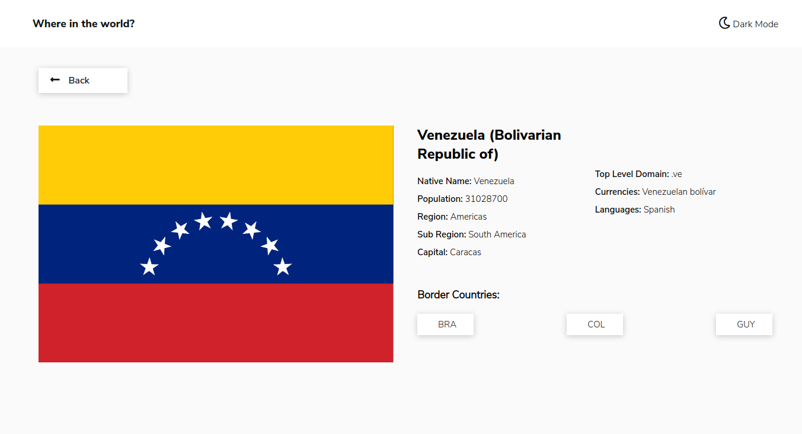

# Frontend Mentor - REST Countries API with color theme switcher solution

Esta es una solución al reto: [REST Countries API with color theme switcher challenge on Frontend Mentor](https://www.frontendmentor.io/challenges/rest-countries-api-with-color-theme-switcher-5cacc469fec04111f7b848ca). 

## Tabla de contenido

- [Vista General](#Vista-General)
  - [El reto](#El-reto)
  - [Screenshot](#screenshot)
  - [Links](#links)
- [Mi proceso](#Mi-proceso)
  - [Construido](#Construido)
  - [Lo aprendido](#Lo-aprendido)
- [Contactame](#Contactame)

## Vista-General

### El-reto

Los usuarios podran:

- Utilizar la SPA y navegar entre sus diferentes secciones sin experimentar un full reload.
- Ver todos los paises traidos desde una API en el home.
- Buscar paises utilizando el `input`
- Filtrar paises por su región
- Clickear en un país para ver mas detalles de dicho país
- Navegar entre los paises vecinos, que encontrara en la sección de detalles.
- Cambiar el mode de la página a oscuro, y este permanecerá guardado a pesar de cerrar el navegador.

### Screenshot

### Links

- Repositorio URL: [https://github.com/anfer-code/countries-api](https://github.com/anfer-code/countries-api)
- Live Site URL: [https://anfer-code.github.io/countries-api/](https://anfer-code.github.io/countries-api/)

## Mi-proceso

### Construido

- HTML5 Semántico
- CSS personalizado
- Flexbox
- Mobile-first workflow
- Webpack 
- Babel
- SPA (Single Page Aplication)

### Lo-aprendido

Fue un reto que comencé para afianzar mis conocimientos adquiridos en el curso de Single Page Aplication en platzi. A su vez fue una manera de retarme para crear mi primer SPA con Vanilla Javascript

## Contactame

- Github - [anfer-code](https://github.com/anfer-code)
- Twitter - [@ValeraAnfer](https://twitter.com/ValeraAnfer)
